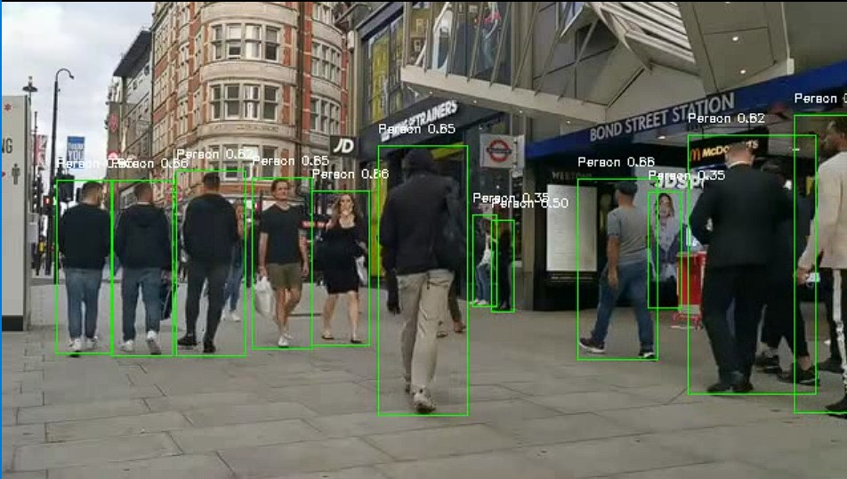
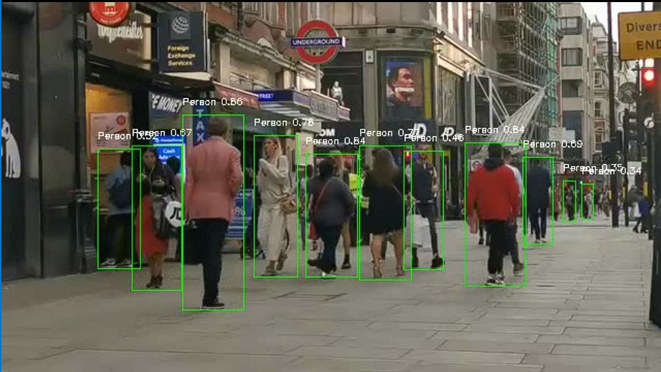
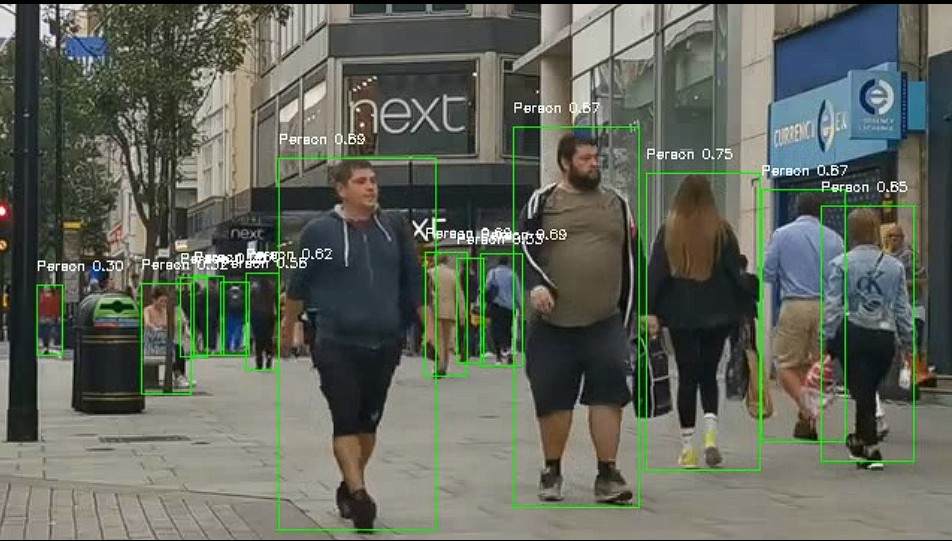
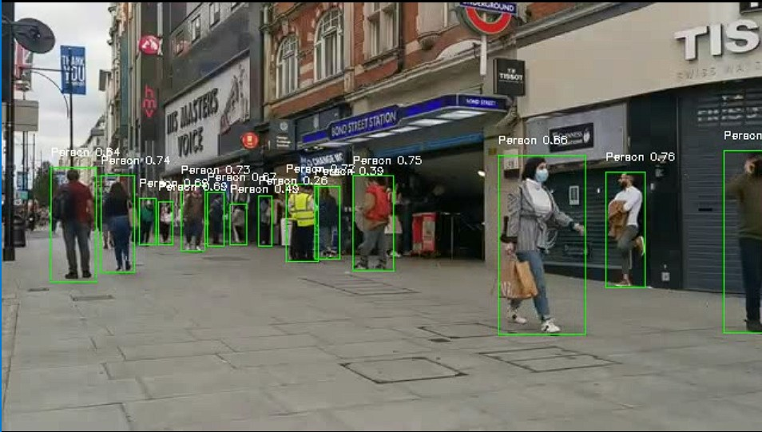

# Object Tracking Algorithms

A comprehensive collection of object tracking algorithms implemented in Python.  
This repository serves as a practical guide and toolkit for understanding, experimenting with, and comparing different computer vision tracking methods.

---

## Overview

Object tracking is a fundamental problem in computer vision, where the goal is to locate and follow objects across frames in a video sequence.  

---
## Input Video

You can test the algorithms using this sample video:  
[Sample Input Video](https://youtu.be/YzcawvDGe4Y?si=Op7HwBKFlnlGQu0Q)

--

## Output

Here are some sample outputs from the implemented detection algorithm (YOLO):

|  |  |
|:---------------------------------:|:---------------------------------:|
| Detection Output 1 | Detection Output 2 |
|  |  |
| Detection Output 3 | Detection Output 4 |


## Installation

### Clone the Repository
```bash
git clone https://github.com/your-username/object-tracking-algorithms.git
cd object-tracking-algorithms
```
---

**Author / Contact**

**Author**: `Dr. Amit Chougule, PhD` 

Email: [amitchougule121@gmail.com](mailto:amitchougule121@gmail.com)
---