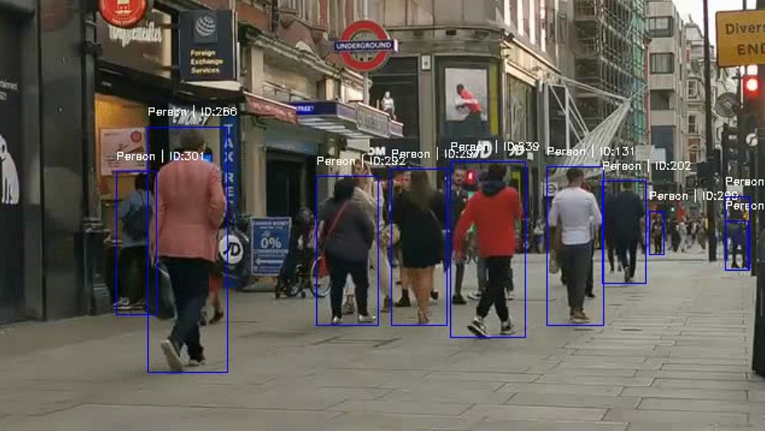
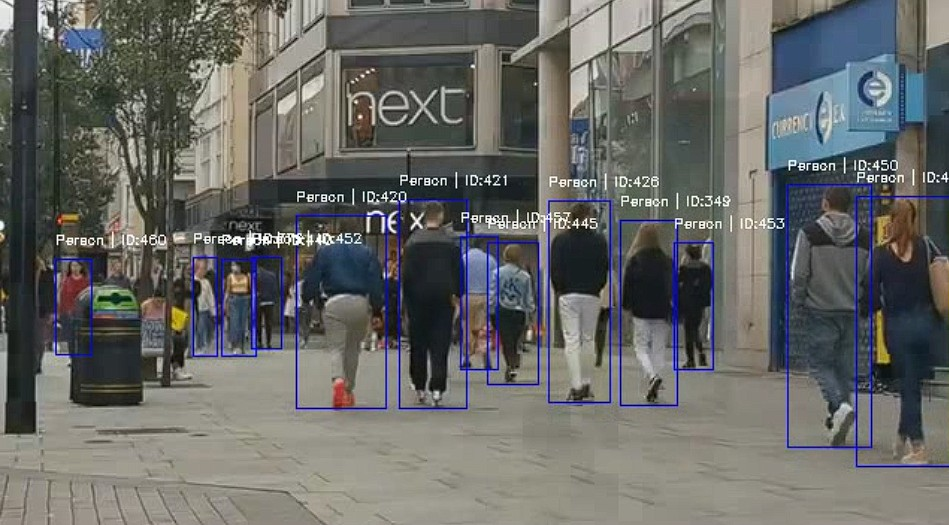
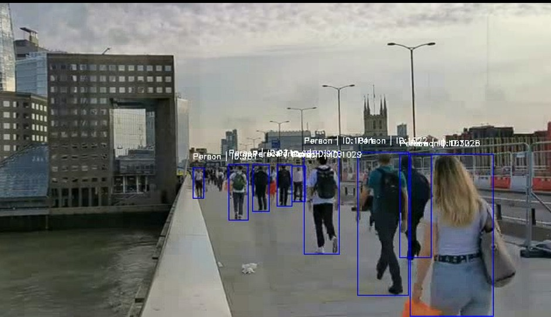

# ByteTrack Person Tracking (Supervision Integration)

- This module implements **ByteTrack** for multi-person tracking in videos using **YOLOv8** for detection and the lightweight, pure-Python [](https://supervision.roboflow.com/) library for tracking.


- It serves as an alternative to the original [ByteTrack repository](https://github.com/FoundationVision/ByteTrack.git), which requires complex builds and dependencies (CMake, Visual Studio Build Tools).  

- Using **Supervision's ByteTrack** (`sv.ByteTrack()`), this implementation is **simple, cross-platform, and fast**, while maintaining robust multi-object tracking performance.

---

## Folder Structure
```
Project/
│
├── .gitignore                         - Git ignore file
├── LICENSE                            - Project license
├── Object_detection_1.py              - YOLOv8-based person detection script
├── Sample_Video.mp4                   - Input sample video
├── Sample_Video_Tracked_ByteSORT.mp4  - Output video with tracking results
├── yolov8n.pt                         - Pre-trained YOLOv8 model weights
│
├── .vscode/
│   └── settings.json                  - VS Code workspace configuration
│
├── Results/
│   ├── Tracking-by-Detection_TbD/
│   │   ├── DeepSORT/                  - Results generated using DeepSORT tracker
│   │   └── SORT/                      - Results generated using SORT tracker
│   └── YOLO_Detection/                - YOLOv8 detection output results
│
└── tracking_algorithms/
    └── Tracking-by-Detection_TbD/
        ├── ByteTrack/
        │   └── ByteSORT.py            - ByteTrack (Supervision-based) tracking script
        │
        ├── DeepSORT/
        │   └── DeepSORT.py            - DeepSORT tracker implementation
        │
        └── SORT/
            ├── SORT.py                - YOLOv8 + SORT tracking script
            └── Alex_Bewley_SORT.py    - Original SORT implementation by Alex Bewley
```

---

## Overview

| Component | Description |
|------------|--------------|
| **Object_detection_1.py** | Provides YOLOv8-based person detection. |
| **ByteSORT.py** | Tracks detected persons using Supervision’s ByteTrack. |
| **Supervision Library** | Supplies a simple, pure-Python `ByteTrack()` class. |
| **Output Video** | `Sample_Video_Tracked_ByteSORT.mp4` – annotated with bounding boxes and person IDs. |

---
## Usage

#### Running the Tracker

```bash
python tracking_algorithms/Tracking-by-Detection_TbD/ByteSORT/ByteSORT.py
```

This will:

1. Load the YOLOv8 model (yolov8n.pt).

2. Detect persons in the input video.

3. Track them across frames using `Supervision’s ByteTrack`.

4. Display live tracking output.

5. Save the final video as `Sample_Video_Tracked_ByteSORT.mp4`.

--- 

## Example Output

Here are some sample outputs from the implemented ByteTrack + detection algorithm (YOLO):

|  |  |
|:---------------------------------:|:---------------------------------:|
| ByteTrack Output 1 | ByteTrack Output 2 |

|  |  |
|:---------------------------------:|:---------------------------------:|
| ByteTrack Output 3 | ByteTrack Output 4 |


**1. Video Information**
| Parameter | Value |
|------------|--------|
| **Resolution** | 640×360 |
| **FPS** | 29 |
| **Total Frames** | 3493 |
| **Tracking** | person |

**2. Frame-wise Performance (last frame)**
| Frame | YOLO FPS | ByteTrack FPS | Overall FPS |
|--------|-----------|----------------|--------------|
| 3493 / 3493 | 12.63 | 453.80 | 11.07 |

**3. Performance Summary**
| Metric | Value |
|---------|--------|
| **Avg YOLO FPS** | 13.69 |
| **Avg ByteTrack FPS** |  |
| **Avg Total FPS** | 11.65 |
| **Total Frames** | 3493 |
| **Total Time** | 306.21 sec |
| **Total Unique Persons Detected** | 636 |

---

## Implementation Highlights

__ByteTrack via Supervision__

```
import supervision as sv
tracker = sv.ByteTrack()
```

This replaces the heavier:

```from yolox.tracker.byte_tracker import BYTETracker``` dependency used in the original ByteTrack repo.

**Input Format**
Each detection (from YOLO) is converted to:
```
	sv.Detections(xyxy=xyxy, confidence=conf, class_id=class_id)
```
	
and passed to:
```
	tracker.update_with_detections(detections)
```

**Outputs**
- Bounding boxes with ID labels
- Real-time FPS display
- Processed video written to disk

---

## Why Use Supervision’s ByteTrack?

- The original ByteTrack repository (FoundationVision/ByteTrack
) often presents challenges related to build configuration and dependency installation.

- As an alternative, the `Supervision` library provides a pure-Python implementation of ByteTrack that enables seamless integration without requiring complex builds or external compilation steps.

- This makes it significantly easier to use and integrate into existing YOLO-based tracking pipelines.

---

## Sample Output Screenshot


---

## References

- [Ultralytics YOLOv8 Documentation](https://docs.ultralytics.com/)

- [Supervision Library (Roboflow) - ByteTrack](https://supervision.roboflow.com/trackers/)

- [ByteTrack Original Repository (FoundationVision)](https://github.com/FoundationVision/ByteTrack)

---

## Author / Contact

- **Author**: `Dr. Amit Chougule, PhD` 

- ### Email: [amitchougule121@gmail.com](mailto:amitchougule121@gmail.com)
---