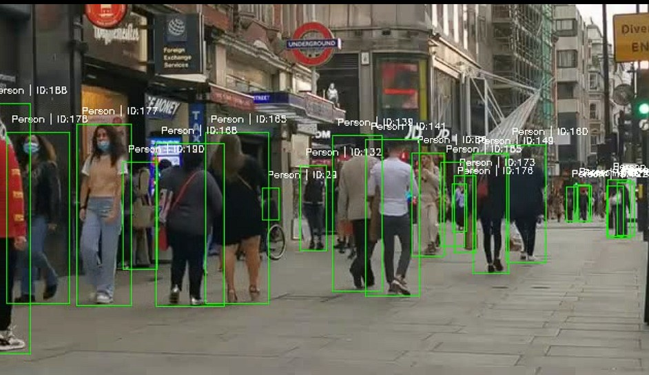
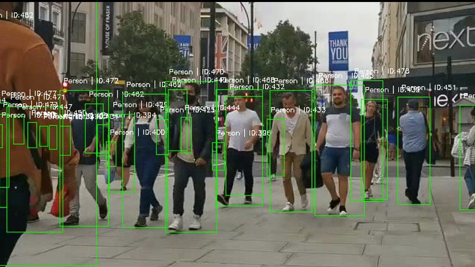
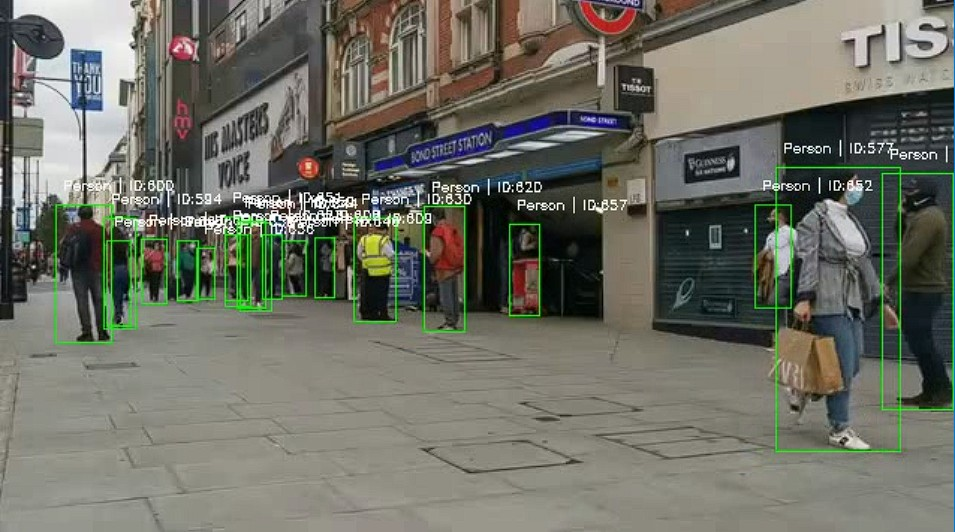
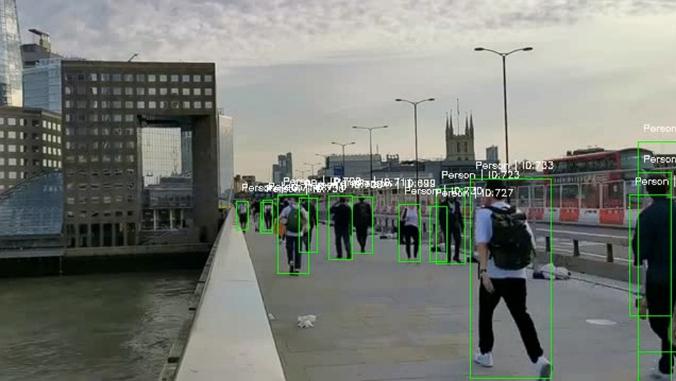

## Overview

- This module implements **Tracking-by-Detection (TbD)** using **YOLOv8** for person detection and **DeepSORT** for multi-object tracking.

- The system first detects all visible persons in each frame using YOLO, and then DeepSORT assigns consistent IDs to track these individuals across frames.

- DeepSORT combines **appearance embeddings (deep features)** and **motion cues (Kalman filtering)** to maintain identities even through temporary occlusions.

---

## Pipeline Architecture

#### 1. Video Input
A video file is read using OpenCV (`cv2.VideoCapture`).


#### 2. Object Detection (YOLOv8)
Each frame is processed by `VideoPersonDetector` (from `Object_detection_1.py`) to detect persons.  
The output detections are in the format:
```text
[x1, y1, x2, y2, confidence]
```

#### 3. Detection Formatting
Detections are converted into the DeepSORT-compatible format:
```python
((x, y, w, h), confidence_score, "person")
```

#### 4. Multi-Object Tracking (DeepSORT)
The DeepSORT tracker associates detections across frames based on:
- Motion prediction via `Kalman Filter`  
- Appearance matching via cosine distance in embedding space  

#### 5. Visualization & Output
Tracked persons are visualized with bounding boxes and unique IDs and the processed video is saved as an output `.mp4` file.


---

## Performance Summary:
  - Original Video FPS: 29
  - Avg YOLO FPS     : 16.61
  - Avg DeepSORT FPS : 2.67
  - Avg Total FPS    : 2.24
  - Total frames     : 3493
  - Total time       : 1564.60 sec
  - Total unique persons detected: 388

## 📸 Output

Here are some sample outputs from the implemented detection algorithm (YOLO):

|  |  |
|:---------------------------------:|:---------------------------------:|
| DeepSORT Output 1 | DeepSORT Output 2 |

|  |  |
|:---------------------------------:|:---------------------------------:|
| DeepSORT Output 3 | DeepSORT Output 4 |

---

## Usage

#### Navigate to the DeepSORT directory:
```bash
cd tracking_algorithms/Tracking-by-Detection_TbD/DeepSORT/
```

#### Run the tracker:
```bash
python DeepSORT.py
```

---

## Parameter Tuning Guide

| Parameter             | Description                                                      | Suggested Range | Impact                              |
| --------------------- | ---------------------------------------------------------------- | --------------- | ----------------------------------- |
| `max_age`             | Maximum number of frames to keep a track alive without detection | 20–50           | Higher -> more tolerant to occlusion |
| `n_init`              | Frames required before a new track is confirmed                  | 2–5             | Higher -> fewer false IDs            |
| `max_cosine_distance` | Threshold for appearance similarity                              | 0.2–0.5         | Lower -> stricter ID matching        |
| `nms_max_overlap`     | Max IoU for overlapping detections                               | 0.7–1.0         | Controls bounding box suppression   |

---
**Author / Contact**

**Author**: `Dr. Amit Chougule, PhD` 

Email: [amitchougule121@gmail.com](mailto:amitchougule121@gmail.com)
---